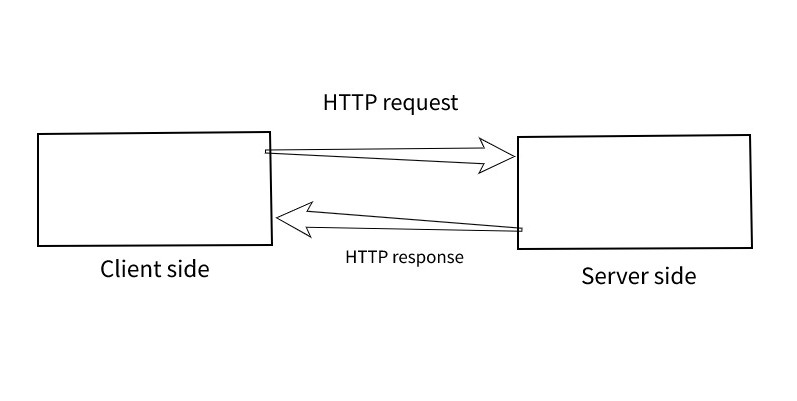
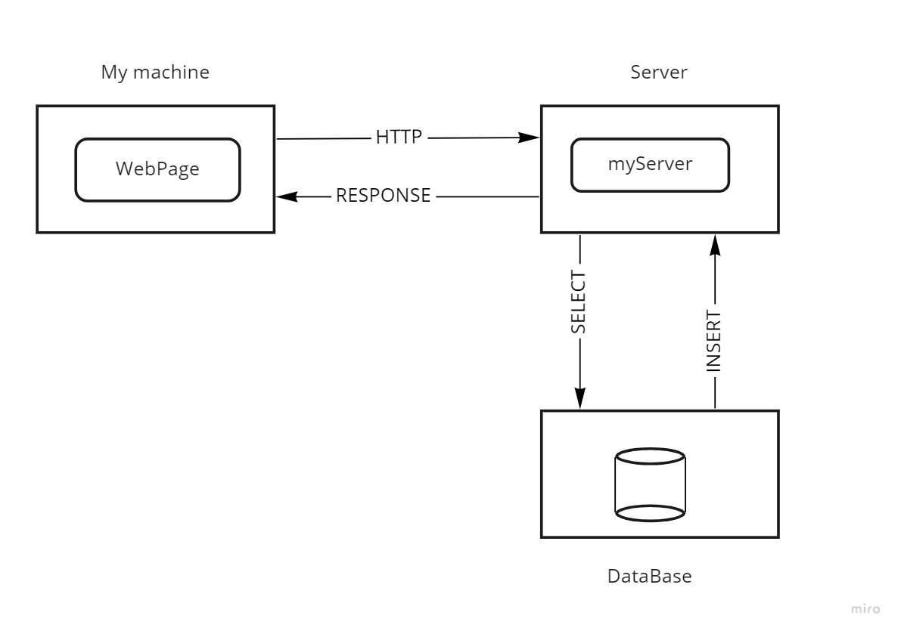
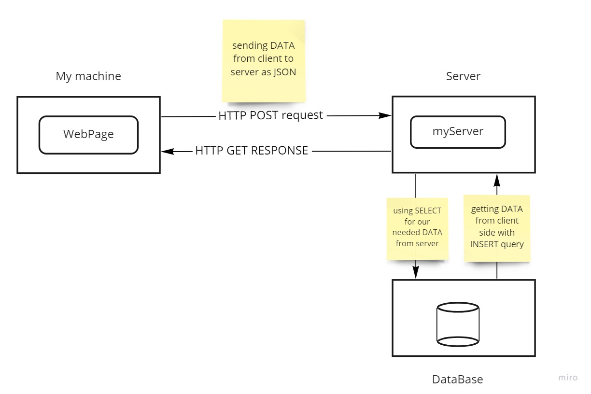

# Movies-Library
# Project Name - Movies-Library

**Author Name**: Hamad Dwairi

## Getting Started
1- Create server.js file

2- npm init -y

3- npm install express

4- const express = require("express")

5- const app = express()

6- app.listen(PORT, ()=>{ console.log("Anything") })

7- I can create end points (ex: app.get("/", helloWorldHandler))

8- I will create the function for that end point(ex: helloWorldHandler)
## WRRC

## WRRC API

We continue building on the steps from the day before Additions 1- Instead of reading from the json file we send a request to a third party API 2- We read the documentation of the API and we tried on the Chrome or PostMan before we use it in our code. 3- We found that we should create an API Key 4- We installed Axios to send an HTTP request to the API. 5- Axios is returning a promise so I should write my code that depend on the request result in the .then function. 6- Axios is returng a huge object so I just care about the data property. 7- We found the API key should not shown in my code so we created .env file and add the API Key there 8- We installed dotenv library the configure it to make our server read the .env file. 9- We created .env.example where we show the required variable for any developer will work on the same project. 10- We created error handler: - We create a function. - We make our server know about it by using app.use - When i want to use I will use it in the .catch function. 11- We created new end point that take the parameter from the URl where we found it inside req.query

## DB WRRC

adding data to the DB

## POST+GET AND PUT+DELETE WRRC

POST GET DELETE

## Overview
Whenevr the client sends a httpRequest , the Server receives it
and sends a httpRequest to the 3rdPartyServer , once the 3rdPartyServer
sends back the response back with the JSON data to the Server , the Server
sends a response back to the client side

## Project Features
- You can explore your favorite movies
- You can check movie information and details