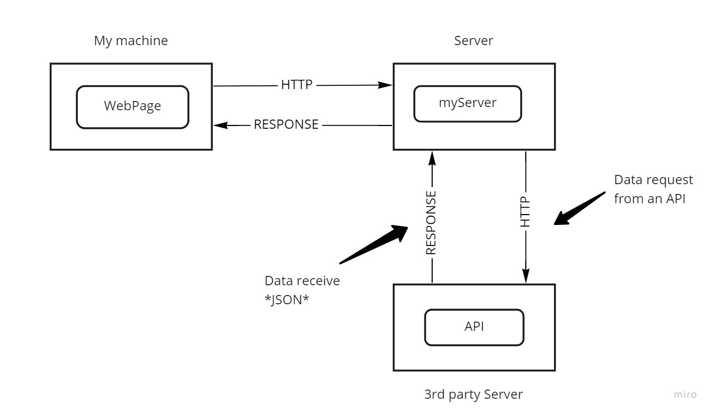

# Movies-Library
# Project Name - Movies-Library

**Author Name**: Hamad Dwairi

## UPDATED WRRC

## Overview
Whenevr the client sends a httpRequest , the Server receives it
and sends a httpRequest to the 3rdPartyServer , once the 3rdPartyServer
sends back the response back with the JSON data to the Server , the Server
sends a response back to the client side

## Getting Started
1- Create server.js file

2- npm init -y

3- npm install express

4- const express = require("express")

5- const app = express()

6- app.listen(PORT, ()=>{ console.log("Anything") })

7- I can create end points (ex: app.get("/", helloWorldHandler))

8- I will create the function for that end point(ex: helloWorldHandler)

## Project Features
- You can explore your favorite movies