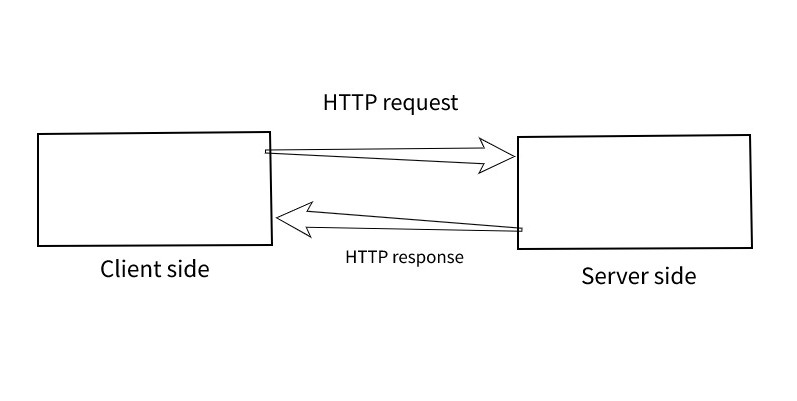

# Movies-Library
# Project Name - Movies-Library

**Author Name**: Hamad Dwairi

## WRRC

## Overview
whenever the client sends a request,the server receives it
looks into it and gets back with the response

## Getting Started
1- Create server.js file

2- npm init -y

3- npm install express

4- const express = require("express")

5- const app = express()

6- app.listen(PORT, ()=>{ console.log("Anything") })

7- I can create end points (ex: app.get("/", helloWorldHandler))

8- I will create the function for that end point(ex: helloWorldHandler)

## Project Features
- You can explore your favorite movies
- You can check movie information and details